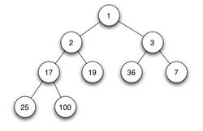
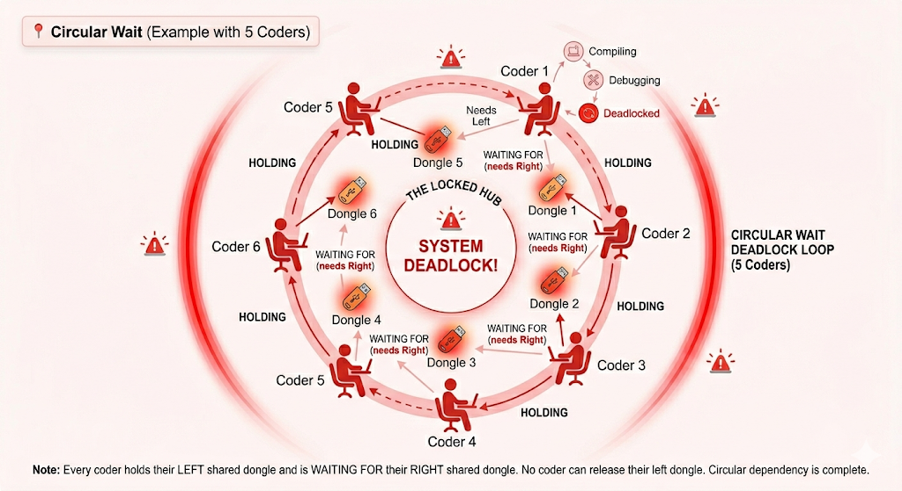
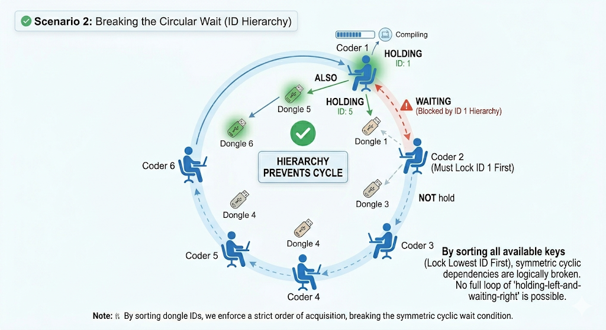

*This project has been created as part of the 42 curriculum by stmaire.*

<div align="center">
<br>
  

  <br>
</div>

# Codexion - POSIX threads, mutexes, and smart scheduling


## 🔵 Description

Codexion is a concurrency-driven simulation designed to master resource synchronization and multi-threaded coordination.

### ✳️ Goal

The primary objective of this project is to orchestrate a shared environment where multiple coders must compete for limited resources—USB dongles—to compile their code before facing a fatal "burnout". The challenge lies in implementing robust synchronization mechanisms to ensure fair resource allocation, prevent deadlocks, and maintain precise timing under strict constraints.

### ✳️ Overview

This project serves as a practical deep dive into POSIX threads and mutexes, requiring a deep understanding of thread-safe communication and race condition prevention.

The simulation operates as follows:


#### Circular Inclusive Hub:
 A set of coders is seated in a circular arrangement, sharing a central Quantum Compiler.

#### Action Cycle:
Coders alternate between three distinct states: compiling, debugging, and refactoring.

#### Shared Resources:
To start a compilation, a coder must simultaneously hold two USB dongles—one from their left and one from their right. There are exactly as many dongles as there are coders.

#### Dongle Cooldown:
After being released, a dongle enters a mandatory cooldown period during which it cannot be reused by any coder.

#### Arbitration & Scheduling:
Global Wait Queue: Instead of checking for dongles locally, every coder joins a single central priority queue (Min-Heap). This act as the simulation's brain: it tracks everyone at once to ensure the most urgent coder always gets served first, no matter where they are sitting.



#### Survival:
Each coder has a time_to_burnout limit. If a coder fails to start a new compilation within this timeframe since their last one, they burn out, and the simulation stops.

#### Monitoring:
A dedicated monitor thread tracks the status of all coders in real-time to detect burnouts within a precise 10ms window.

## 🔵 Instructions

### ✳️ Compilation

The project includes a `Makefile` that handles the compilation process using cc with the required `-Wall -Wextra -Werror and -pthread` flags. To compile the program, run the following command in your terminal:

```
make
```
This will generate the executable named `codexion`. You can also use the rules: `clean`, `fclean`, `re`, and `all`.


### ✳️ Execution

```Bash
./codexion <n_coders> <burnout> <compile> <debug> <refactor> <n_compiles> <cooldown> <scheduler>
```

### ✳️ Cleanup

`make clean`: Removes object files (.o) and .d.

`make fclean`: Removes object files and the Codexion executable.

`make re`: Recompiles everything from scratch.

## 🔵 Resources

### ✳️ References
To build this project, several key concepts were explored:

* Threads:

https://franckh.developpez.com/tutoriels/posix/pthreads/

https://man7.org/linux/man-pages/man7/pthreads.7.html

https://youtube.com/playlist?list=PLfqABt5AS4FmuQf70psXrsMLEDQXNkLq2&si=E3HYp_fHYya2iv63

* Queue :

https://fr.wikipedia.org/wiki/File_(structure_de_donn%C3%A9es)

* Heap:

https://www.geeksforgeeks.org/c/heap-in-c/

https://chgi.developpez.com/arbre/tas/

* EDF algorithm:

https://www.youtube.com/watch?v=33PyyzqAd6Y


### ✳️ AI Usage
I used AI to help me build this project in the following ways:

- Learning Threads: I used AI to do small exercises and better understand how pthreads, mutexes, and condition variables work.

- Testing the Parser: I asked the AI to create different lists of arguments (like negative numbers or wrong words) to make sure my program handles errors correctly.

- Fixing the Heap: I used it to help me find bugs in my "Heap" (the priority queue). It helped me check if my logic for moving elements up and down was correct.

- Explaining Concepts.

- Writing this README: I used AI to help me translate this documentation into English.


## 🔵 Blocking cases handled ##

### ✳️ Deadlock Prevention (Coffman's Conditions) ###

Deadlocks occur when four specific conditions (the Coffman conditions) are met simultaneously: Mutual Exclusion, Hold and Wait, No Preemption, and Circular Wait.




To prevent this, my solution breaks the Circular Wait condition:

**Resource Hierarchy:** Instead of always taking the left dongle first, each coder compares the IDs of their two available dongles. They must pick up the one with the lowest ID first.

**Breaking the Chain:** Because the hub is circular, this rule ensures that at least one dongle always remains free, allowing the chain of requests to be completed instead of locking up.



### ✳️ Atomic acquisition ###
A coder only starts "Compiling" once they successfully hold both dongles. If they manage to grab one but the second is unavailable, they immediately release the first one. This "all or nothing" approach prevents a coder from holding onto a resource while blocking others unnecessarily.
### ✳️ Starvation prevention and fairness ###
To ensure no coder is forgotten or "skipped" by their neighbors, the simulation uses a global wait queue. Instead of just checking if the resources next to them are free, all coders join a common list sorted by priority.

**Order of Action**: The system guarantees that the most urgent coder (the one closest to burning out or the one who has been waiting the longest) is always moved to the front of the line.

**Absolute Priority**: A coder will never take a dongle unless they are at the very top of the queue, even if their specific resources are available. This forces faster coders to yield their turn to those in need, ensuring everyone can compile in time and no one is left behind.

### ✳️ cooldown handling ###

Each dongle has two safety checks:

* **is_unused:** The dongle is not currently held by another coder.

* **is_available:** The mandatory cooldown period has passed since its last use.

A coder can only take a dongle if both conditions are met.
### ✳️  precise burnout detection ###

A dedicated Monitor Thread constantly checks the status of all coders. If a coder misses their deadline or the simulation requirements are met, it sends an immediate signal to stop all threads. This ensures that burnout is detected and logged within the required 10ms window.

### ✳️  log serialization ###
To prevent "garbled" text in the terminal, all display functions are protected by a global write mutex. This ensures that messages (like "has taken a dongle" or "is compiling") appear one by one and in the correct chronological order.


## 🔵 Thread Synchronization Mechanisms

This section describes the tools and strategies used to coordinate actions between the coders and the monitor thread.

### ✳️ Threading Primitives

* **`pthread_mutex_t`**: Used to protect access to dongles, priority queues, and various simulation elements. Every log display and sensitive variable modification is protected by a mutex, which acts as a secure lock.

* **`pthread_cond_t`**: Used to put threads into a deep sleep when a resource is unavailable. This avoids consuming CPU cycles unnecessarily (busy waiting).

### ✳️ Resource Coordination (Dongles)

The access to USB dongles follows an organized system:

**Priority Verification**: A coder checks if they are at the front of the queue using the priority logic defined by the scheduler (FIFO or EDF).

* **Conditional Waiting**:

* **If the dongle is in use**: The thread uses `pthread_cond_wait`.

* **If the dongle is cooling down**: The thread uses `pthread_cond_timedwait` for a precise sleep until the `dongle_cooldown` .
* **Release & Notification**: When a coder releases their dongles, a `pthread_cond_broadcast` wakes up all coders waiting for those specific resources so they can re-evaluate their priority.


### ✳️ Coder ↔ Monitor Communication
- **Thread-Safety**: Communication relies on shared variables between the coders and the monitor thread.

- **Protected Access**: The monitor locks a mutex to stop the simulation if a burnout is detected or if the required number of compiles is reached.

- **Continuous Checking**: Every coder, at each loop iteration and during their action cycles, checks the simulation status to see if they must terminate their work.

### ✳️ Race Condition Prevention Examples

**Dongle State Atomicity**
* **The Risk**: A race condition could occur if a coder reads a dongle as "available" at the exact same moment another coder is seizing it. Without protection, two threads might believe they have successfully taken the same resource.
* **The Solution**: The transition of the dongle state from **available** to **unavailable** happens strictly while the `dongle_mutex` is locked. This ensures the no other thread can read or modify the dongle's status until the current coder has fully secured it.
### ✳️ Simulation Status Protection
* **The Risk**: A race condition could occur if a coder checks the simulation state while the Monitor thread is updating it to "stopped".
* **The Solution**: The `is_running` flag is protected by a dedicated mutex and accessed via a thread-safe getter function. This creates a memory barrier, ensuring all threads see the same status simultaneously and stop immediately upon burnout or success.

### ✳️ Heap & Priority Queue Integrity
* **The Risk**: Local Starvation.

Two fast neighbors could trade dongles back and forth forever, leaving the coder in the middle with no chance to grab both at once.

* **The Solution**: Global priority.

By using a Global Priority, no coder can touch a dongle unless they are at the very top of the queue. This prevents neighbors from "bullying" others and ensures everyone eventually moves to the front.

* **The Risk**: Burnout Miss (EDF)

If we allowed a coder to jump ahead just because their specific keys were free, we might waste the exact 500ms needed by a dying coder who is still waiting for a resource.

* **The Solution**: Deadline Protection.

Forcing everyone to follow the global order reserves the "Quantum Compiler" for the most at-risk coder. We prioritize survival over maximum parallelization.

## 🔵 Simulation examples

The Codexion simulation accurately reflects real-world concurrency limitations. Below are two examples demonstrating both a successful execution and a case of mathematically inevitable starvation.

### ✳️ 1. Survival (Mathematically Possible)
```bash
./codexion 5 600 100 100 100 5 100 edf
```

In this scenario, the simulation runs without any burnouts. With 5 coders and 5 dongles, a maximum of 2 coders can compile simultaneously. Since each compile cycle locks a pair of dongles for 200ms (100ms compile + 100ms cooldown), a full table rotation requires 3 waves, taking roughly 500ms to 600ms. A time_to_burnout of 600ms provides the necessary system buffer for threads to context-switch safely.

### ✳️ 2. The Theoretical Limit (Mathematically Impossible in Practice)
```bash
./codexion 5 500 100 100 100 5 100 edf
```

This is an edge-case stress test where a burnout is guaranteed to happen at exactly 501ms.

| Time (ms) | Table Event | Coder 3 Status (Deadline: 500ms) |
| :--- | :--- | :--- |
| **0** | **Wave 1:** Coders 1 (keys 1,2) and 3 (keys 3,4) compile. | Compiling. Next survival deadline set to **500ms**. |
| **100** | End of Wave 1. Keys 1, 2, 3, and 4 enter *cooldown*. | In *debugging* phase. |
| **200** | **Wave 2:** Coders 5 (keys 5,1) and 2 (keys 2,3) compile. | Cycle finished. **Blocked**: key 3 is locked by Coder 2. |
| **300** | End of Wave 2. Keys 5, 1, 2, and 3 enter *cooldown*. | Still **blocked** (key 3 is cooling down). |
| **400** | **Wave 3:** Coder 4 (keys 4,5) compiles. | **Blocked**: key 4 was just taken by Coder 4. |
| **500** | End of Wave 3. Keys 4 and 5 enter *cooldown*. | 💀 **Burnout.** The 500ms deadline is reached. Coder 3 is still blocked by key 4's cooldown. |
| **600** | Key 4 is finally cold. The loop is complete. | *(Dead for 100ms, but would have been able to take their keys here).* |

## 🔵 The Universal Survival Formulas

The simulation's ability to run indefinitely without any burnouts is strictly bound by the laws of resource allocation and geometry. Depending on whether the number of coders is **even** or **odd**, the mathematical threshold changes significantly.

Let:
* `C` = `time_to_compile` (Duration a coder holds the dongles)
* `D` = `dongle_cooldown` (Mandatory cooling period before a dongle can be used again)
* `B` = `time_to_burnout` (The starvation deadline)

---

### ✳️ 1. Even Number of Coders

When the table has an even number of coders (e.g., 4 or 6), they can be split into two perfectly symmetrical groups that do not share any resources. The table alternates flawlessly between these two waves, resulting in a maximum waiting time of exactly **2 full cycles**.

$$\mathbf{(C + D) \times 2 < B}$$

* **Example:** For `./codexion 4 450 100 100 100 5 100 edf`
  * Each wave locks a pair of dongles for $100\text{ms} + 100\text{ms} = 200\text{ms}$.
  * With an even number of coders, it takes exactly 2 waves ($2 \times 200\text{ms} = 400\text{ms}$) for a full table rotation.
  * Since $400\text{ms} < 450\text{ms}$, this simulation will **succeed indefinitely**.

---

### ✳️ 2. Odd Number of Coders
When the table has an odd number of coders (e.g., 3 or 5), a perfect split is geometrically impossible. One dongle will always sit idle in each wave, creating a "musical chairs" effect. This asymmetry forces the scheduler to process the table in **3 distinct waves**, creating a much harsher rotation delay for the most bottlenecked coder.

$$\mathbf{(C + D) \times 3 < B}$$

* **Example:** For `./codexion 5 500 100 100 100 5 100 edf`
  * Each wave locks resources for $200\text{ms}$.
  * Because the table size is odd, the scheduling queue requires 3 full waves to complete a single rotation ($3 \times 200\text{ms} = 600\text{ms}$).
  * Since $600\text{ms} > 500\text{ms}$, a burnout is **mathematically guaranteed** to happen.

---

### ✳️ Summary

| Coders Count | Minimum Required Rotation Time | Starvation Condition |
| :--- | :--- | :--- |
| **Even ($2n$)** | $2 \times (\text{Compile} + \text{Cooldown})$ | Failed if $\text{Burnout} \le 2 \times (\text{Compile} + \text{Cooldown})$ |
| **Odd ($2n+1$)** | $3 \times (\text{Compile} + \text{Cooldown})$ | Failed if $\text{Burnout} \le 3 \times (\text{Compile} + \text{Cooldown})$ |

###


*Credits: Images generated by gemini and  https://upload.wikimedia.org/wikipedia/commons/6/69/Min-heap.png*
